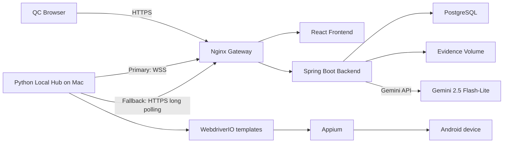

# OpsHub Android MVP Design

**Date:** 2026-07-26  
**Status:** Approved design  
**Source:** OpsHub PRD and four supplied UI mockups

## 1. Objective

Build a fast internal MVP that lets QC users manually define campaign OA expectations, validate those inputs, generate five controlled Android test cases per OA, approve the plan, run it sequentially through a MacBook-connected Android device, and review persisted results and evidence.

The MVP prioritizes one dependable Android path. It does not include authentication, Jira ingestion, additional platform runners, dashboards, reports, or free-form AI-generated automation code.

## 2. Scope

### 2.1 In scope

- A four-screen Test Operations workflow.
- Manual Jira ID and OA input.
- Android as the only available platform.
- Hybrid deterministic and Gemini validation.
- Exactly five versioned test templates per OA.
- QC review and approval before execution.
- Sequential execution by OA order and test-case order.
- A Python Local Hub running on the MacBook.
- WebSocket communication with automatic HTTP long-polling fallback.
- Result, log, retry, duration, and screenshot evidence capture.
- Dockerized frontend, backend, gateway, and PostgreSQL on Rocky Linux 9.

### 2.2 Deferred

- User authentication, authorization, and roles.
- Jira or MCP ingestion.
- iOS, Web, and PC execution.
- Dashboard, Test Results, Reports, and Settings pages.
- Parallel execution.
- Free-form AI-generated automation code.
- Individual test-case reruns.
- Object storage, notifications, high availability, and horizontal scaling.

## 3. Architecture

The VPS hosts an Nginx gateway, React frontend, Spring Boot backend, and PostgreSQL database. The MacBook hosts the Python Local Hub, Node.js/WebdriverIO, Appium, and the Android device.

The Spring Boot application is a modular monolith. Its internal modules cover OA input, validation, generation, approval, execution orchestration, evidence, and Hub communication, but they deploy as one container.



### 3.1 Repository layout

```text
backend/                  Spring Boot modular monolith
frontend/                 React and TypeScript four-screen UI
local-hub/                Python connection and execution daemon
local-hub/templates/      Tracked parameterized TypeScript templates
gateway/                  Nginx configuration
deploy/                   Docker Compose and Rocky Linux deployment
docs/                     PRD, architecture, contracts, and plans
data/                     Ignored local runtime artifacts
mobile_script/            Ignored original reference project
```

The original `mobile_script/` remains ignored. Clean, parameterized versions of its test logic and required page objects are tracked under `local-hub/templates/android/`. Dependencies, generated scripts, evidence, and runtime output remain ignored.

## 4. Domain model

### 4.1 Core records

- **TestOperation:** Jira ID, current revision, aggregate status, timestamps.
- **OfficialAccount:** operation, OA order, platform, thumb URL, content, parsed header and body, button text, redirect URL.
- **ValidationRun:** operation revision, policy version, Gemini model, aggregate status, timestamp.
- **FieldValidation:** field, validator type, status, issues, locations, suggestions, severity, confidence.
- **TestPlan:** source revision, template catalog version, generation status, approval state.
- **TestCase:** OA order, fixed test order, template ID, parameters, readiness status.
- **Execution:** approved plan, Hub, lease, queue state, start and finish timestamps.
- **TestResult:** test case, attempt, result status, duration, error category, expected and actual result.
- **Evidence:** result, evidence type, relative path, size, checksum.
- **Hub:** Hub ID, connection state, transport, heartbeat, device and runner capabilities.

### 4.2 Status lifecycle

```text
DRAFT
  -> VALIDATING
  -> VALIDATION_FAILED | VALIDATED
  -> GENERATING
  -> GENERATION_FAILED | READY_FOR_APPROVAL
  -> APPROVED
  -> QUEUED
  -> RUNNING
  -> PASSED | FAILED | ERROR
```

Field validation statuses are `PASSED`, `WARNING`, `FAILED`, `UNABLE_TO_CHECK`, and `INVALID`. Only `PASSED` satisfies generation gating.

### 4.3 Revision and invalidation

- Every OA edit, platform change, add/remove action, or reorder increments the operation revision.
- Previous validation results and generated plans become `INVALID`.
- Generation, approval, and execution remain locked until the current revision is revalidated and regenerated.
- Every downstream record carries its source operation revision.
- The backend rejects stale mutations and execution commands regardless of frontend state.

## 5. Validation

### 5.1 Deterministic validation

Java validators handle:

- Required fields and supported platform.
- Leading, trailing, doubled, or embedded raw whitespace rules.
- URL and deeplink parsing.
- Rejection of the `stg-` URL prefix.
- Android platform compatibility.
- Thumbnail redirects, HTTP success, `image/*` content type, maximum size, timeout, and real-image decoding.

### 5.2 Gemini validation

Gemini validates Vietnamese spelling, sentence casing, spacing, UX wording, and misleading claims. The backend calls Gemini; neither the frontend nor Local Hub receives the key.

Gemini output must satisfy a strict JSON schema before it is accepted. Free-form model output never controls gating or produces executable code. Timeout, rate limiting, dependency failure, or malformed output produces `UNABLE_TO_CHECK` with a retryable reason.

Configuration:

```text
GEMINI_API_KEY=<secret>
GEMINI_MODEL=gemini-2.5-flash-lite
```

The model name is configurable so the backend can switch to `gemini-2.5-flash` without a code change if validation quality is insufficient.

For local development the real key resides in `backend/.env`, which Git ignores. The repository contains only `backend/.env.example`. On the VPS the key resides in `/opt/opshub/secrets/backend.env`, outside the Git checkout, with restrictive file permissions.

Free-tier requests must contain only the OA fields required for validation because free-tier content may be used by the provider to improve its products.

### 5.3 Content parsing

The UI retains one Content textarea:

- The first non-empty line is `EXPECTED_HEADER`.
- All remaining lines, preserving line breaks, are `EXPECTED_BODY`.
- Content fails deterministic validation if either portion is absent.
- Screen 1 and Screen 2 show the parsed values before generation.

### 5.4 Gating

- AI Validation is available only when every OA has all required inputs.
- Generate is available only when every field of every OA is `PASSED`.
- `WARNING`, `FAILED`, `UNABLE_TO_CHECK`, and `INVALID` all block generation.
- Suggestions are never applied automatically and never auto-pass a field.

## 6. Test generation

Every Android OA produces exactly five test cases in this order:

1. OA delivery and unread badge.
2. Thumbnail display and comparison.
3. Header and body content comparison.
4. Button text comparison.
5. Button redirect comparison.

Initial template IDs are:

- `android-oa-delivery-v1`
- `android-thumbnail-v1`
- `android-content-v1`
- `android-button-text-v1`
- `android-redirect-v1`

The backend generates a structured plan containing template IDs and typed parameters. A strict renderer JSON-escapes substitutions and materializes tracked templates. TypeScript syntax validation must succeed before a test case becomes `READY`.

Gemini cannot choose a subset, add imports, change selectors, introduce commands, or create code. QC can inspect template metadata, parameters, and rendered TypeScript. Editing an OA-derived value creates a new revision and invalidates the plan.

## 7. Frontend workflow

The MVP has no sidebar. It contains only the four connected screens and their step indicator.

The four supplied PRD mockups are the visual source of truth for these screens. Implementation must preserve their information hierarchy, four-step progress indicator, card and table structure, status colors, action placement, typography scale, spacing rhythm, and execution-queue presentation. The sidebar shown in the references is the only intentional structural omission. Responsive behavior may reflow the layout for narrower screens, but it must not change the workflow, content priority, status semantics, or gating behavior. Frontend visual verification must compare each implemented screen against its corresponding mockup at the primary desktop viewport.

### 7.1 Screen 1: Input OA Details

- Enter Jira ID.
- Add, remove, and reorder OAs.
- Android is the only platform shown.
- Enter Thumb URL, Content, Button Text, and URL Direction.
- Preview parsed header and body.
- Autosave drafts using optimistic revision checks.
- Enable AI Validation only when all OA inputs are complete.

### 7.2 Screen 2: Verify Inputs

- Show aggregate and per-field statuses.
- Show error locations, suggestions, severity, confidence, and policy version.
- Link each issue back to its OA field.
- Re-check the current revision.
- Explain why every disabled action is unavailable.
- Enable Generate only when all fields pass.

### 7.3 Screen 3: Generate and Review

- Show exactly five ordered cases per OA.
- Show description, template, parameters, and readiness.
- Expand a case to inspect rendered TypeScript.
- Regenerate invalid or not-ready cases.
- Do not provide add/delete controls in the MVP.
- Enable Confirm only when all cases are ready.
- Confirm performs QC approval for the current plan and revision.

### 7.4 Screen 4: Confirm and Execute

- Show the ordered OA queue and current OA.
- Enable Start only when the approved plan is current and the Hub/device are ready.
- Show per-test progress, result, duration, retry count, logs, and evidence.
- Continue after test and OA failures.
- Show a final aggregate summary.
- Permit full-plan reruns; individual-case reruns are deferred.

The frontend receives live state over WebSocket and falls back to periodic REST refresh. Backend state remains authoritative.

## 8. Local Hub

### 8.1 Startup and transport

The Python Hub loads its backend URL, Hub ID, Hub token, template directory, and work directory from local environment configuration. It checks Node.js, WebdriverIO, Appium, ADB, the Android device, and Zalo before reporting ready.

The Hub connects through authenticated WebSocket and sends heartbeats and capabilities. After repeated WebSocket upgrade or connection failures it switches to HTTPS long polling. It periodically probes WebSocket and switches back when available.

### 8.2 Job execution

For each job the Hub:

1. Receives the immutable execution ID, idempotency key, revision, ordered cases, typed parameters, and template versions.
2. Acquires a time-limited lease.
3. Rejects stale revisions, unsupported platforms, missing templates, or invalid parameters.
4. Materializes scripts under `data/generated-tests/<execution-id>/`.
5. Executes one WebdriverIO spec at a time.
6. Streams progress and logs when connected.
7. Captures evidence and uploads results.
8. Continues through all five cases and all OAs.
9. Completes and releases the lease.

### 8.3 Reliability

- Heartbeats renew active leases.
- The backend requeues work only after lease expiry.
- A local execution journal prevents duplicate execution after reconnect or requeue.
- Assertion failures do not retry.
- Infrastructure errors retry once after resetting the Appium session.
- The result records both attempts and the final classification.
- Evidence upload retries independently and never reruns a test.
- When both transports are unavailable, results remain in a local outbox and synchronize after reconnect.
- The Hub never connects directly to PostgreSQL and never receives the Gemini key.

## 9. Execution and evidence policy

- Execute by OA order and then fixed test order 1 through 5.
- Run all five tests even if an earlier test fails.
- Continue to every later OA even if an OA fails.
- An OA passes only when all five final test results pass.
- An operation passes only when all OAs pass.
- Capture the final screen for every passed test.
- Capture the failure/error screen for failed and errored tests.
- Retain text logs for every attempt.

Screenshots and execution logs are uploaded to a persistent VPS filesystem. PostgreSQL stores their metadata and relative paths rather than binary blobs.

Runtime paths are:

```text
/opt/opshub/secrets/backend.env
/opt/opshub/data/evidence
/opt/opshub/data/logs
/opt/opshub/postgres
```

Local `data/` contains `evidence/`, `generated-tests/`, and `tmp/`, and is ignored by Git.

## 10. Interfaces

Primary REST resources:

```text
/api/v1/operations
/api/v1/operations/{id}/oas
/api/v1/operations/{id}/validate
/api/v1/operations/{id}/generate
/api/v1/operations/{id}/approve
/api/v1/operations/{id}/executions
/api/v1/executions/{id}
/api/v1/executions/{id}/evidence
/api/v1/hubs
/api/v1/hubs/{hubId}/jobs/next
/api/v1/hubs/{hubId}/heartbeat
```

Primary Hub WebSocket endpoint:

```text
/ws/v1/hubs/{hubId}
```

WebSocket messages use versioned JSON envelopes containing message ID, type, timestamp, execution ID, lease ID, and payload. HTTP fallback reuses the same command and result payload schemas.

OpenAPI defines REST contracts. JSON Schema defines Hub messages and template parameters. Contract fixtures are shared between backend, frontend, and Hub tests.

## 11. Deployment and minimal security

VPS containers are:

- `gateway`: Nginx TLS termination, static routing, REST proxying, and WebSocket upgrade.
- `frontend`: React static files.
- `backend`: Spring Boot modular monolith.
- `database`: PostgreSQL.

Flyway manages database migrations. Backend health and readiness endpoints support container checks. PostgreSQL and backend ports are not exposed publicly. Nginx enforces request/upload limits and proxy timeouts. Containers restart automatically.

MVP omits user authentication. Network access should be constrained through firewall, VPN, or IP allowlisting where practical. A random Hub token protects Hub endpoints and WebSocket sessions. The future user-authentication layer can protect `/api/v1/**` without changing business contracts.

## 12. Error handling

- Validation dependency failures become field-level `UNABLE_TO_CHECK` results.
- Malformed Gemini output is rejected and never used for gating.
- Stale revisions return a conflict response containing the current revision.
- Template or parameter failures keep the affected test case not ready and block approval.
- Hub-offline and device-not-ready states block execution and state the reason.
- Assertion failures are product/test results; infrastructure errors are operational results.
- Evidence upload failure is tracked separately from the test outcome.
- Every external call has a timeout and bounded retry behavior.

## 13. Testing strategy

### 13.1 Backend

- Unit tests for validators, content parsing, gating, state transitions, invalidation, template parameters, leases, idempotency, and retry classification.
- PostgreSQL/Testcontainers integration tests for persistence and Flyway migrations.
- Gemini adapter contract tests with schema-valid, invalid, timeout, and rate-limit fixtures; routine tests do not consume API quota.

### 13.2 Frontend

- Component tests for field status rendering, disabled reasons, OA reordering, revision conflicts, and generation readiness.
- End-to-end tests for the four-screen happy path, validation failure/correction path, and stale revision path.

### 13.3 Local Hub and templates

- Unit tests for WebSocket-to-polling fallback, reconnect, outbox replay, lease renewal, deduplication, process parsing, retry behavior, and evidence upload.
- Contract tests render all five templates with Vietnamese text, quotes, newlines, emoji, and URL characters, then run TypeScript syntax checks.
- One acceptance run uses the actual MacBook, Android device, Zalo installation, Appium, and WebdriverIO stack.

### 13.4 Deployment

- Docker Compose smoke tests verify gateway, frontend, backend, and PostgreSQL health and routing.

## 14. MVP acceptance criteria

The MVP is accepted when it can:

1. Create and reorder multiple Android OAs under a manually entered Jira ID.
2. Validate every field and show field-level findings.
3. Correct failed input, invalidate stale state, and revalidate.
4. Generate exactly five ready test cases per OA from tracked templates.
5. Approve only the current revision and fully ready plan.
6. Start execution through a connected and ready Mac Hub/device.
7. Execute all tests and OAs sequentially.
8. Continue after assertion failures and retry infrastructure errors once.
9. Persist and display results, retries, logs, and screenshot evidence.
10. Demonstrate WebSocket operation and automatic HTTP fallback.
11. Prove that any input edit or OA reorder invalidates validation, generation, and approval.
